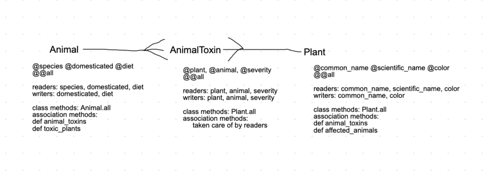

# Domain Practice lv1: Part Two

## First Step
In this file you'll see one way you could have drawn this out. Some of our methods might be called different things; that's fine! Check against what your group drew; where there elements in the solution you didnt cover? Anything that is unclear? 

## Your Instructions
Inside of `all_classes.rb`, write the basics of each class. You are essentially converting your plan from the first part into code! This should include...
- initialize
- attr's / readers & writers
- class variables and methods
- object association methods
- at the bottom of the file, create enough instances that you'd be able to test. 

## Next Steps
Compare your solutions to that inside of `solution_class_basics.rb`. 

The idea behind mapping out the ERD and getting clarity on writing these first methods easily (and quickly) is to give you more time to work on more logic heavy work. 
Time permitting, with your group write pseudocode (comments in plain english for how you'd achieve the behavior) for the following methods. Convert them if you have time as well. 
- `Plant.most_toxic` will return the plant instance with the highest toxicity to any animal. 
- `Animal.most_allergies` will return the animal instance that has the highest number of plants that it's affected by.
- `Animal#allowed_plants` will return an array of plants that this animal is *not* affected by. 
